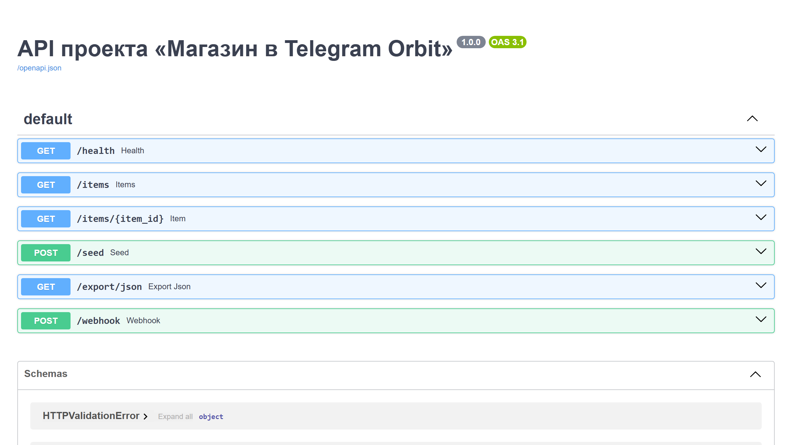

# Магазин в Telegram Orbit

## Витрина

Скриншоты и GIF складываются в `assets/`.

- shot-list: `SHOTLIST.md`
- assets: `assets/README.md`



`Магазин в Telegram Orbit` показывает, как Telegram-бот может заменить разрозненный процесс продаж: собрать каталог, провести клиента через корзину и доставку, передать заказ оператору и не терять выручку на брошенных корзинах и ручной переписке.

## Что показывает проект

- полноценный Telegram-магазин, а не просто каталог товаров;
- связку `каталог -> корзина -> заказ -> доставка -> операторская обработка`;
- прикладную e-commerce-логику с апсейлами, сегментацией клиента и контролем заказов;
- архитектуру, которую можно адаптировать под нишевой магазин, подарочные наборы, доставку еды или продажи подписок.

## Для каких задач подходит

- запуск Telegram-магазина без отдельного мобильного приложения;
- перенос продаж из хаотичных чатов в управляемый процесс;
- оформление быстрых заказов с участием оператора;
- сценарии повторных покупок, допродаж и работы с abandoned cart;
- связка Telegram-магазина с CRM, оплатой, складом и внутренней командой.

## Ключевые сценарии

- быстрый заказ из каталога;
- повторная покупка по истории клиента;
- подарок или комплект с апсейлом;
- заказ с доставкой “сегодня”;
- ручная доработка заказа оператором.

## Роли

- клиент;
- оператор;
- склад;
- владелец бизнеса.

## Категории

- электроника;
- одежда и стиль;
- товары для дома;
- подарки;
- подписки и цифровые пакеты.

## Состав пакета

- `bot/domain.py`
- `bot/storage.py`
- `bot/workflow.py`
- `bot/analytics.py`
- `bot/reporting.py`
- `bot/policies.py`
- `bot/contracts.py`
- `bot/exports.py`
- `bot/simulation.py`
- `bot/admin.py`
- `bot/messages.py`
- `bot/seeds.py`
- `bot/service.py`
- `bot/repository_sqlite.py`
- `bot/webhooks.py`
- `bot/api.py`
- `bot/cli.py`
- `bot/dashboard_schema.py`
- `bot/fixtures.py`
- `bot/audits.py`
- `bot/benchmarks.py`
- `bot/main.py`
- `tests/test_logic.py`

## Быстрый старт

```bash
pip install -r requirements.txt
python -m bot.main
uvicorn bot.api:create_app --factory --reload
```

## Почему это сильный кейс

- показывает не “бота ради бота”, а коммерческий продукт с понятной экономикой;
- хорошо раскрывает направление `Telegram commerce`, `e-commerce workflow`, `операторская обработка`, `CRM-сигналы`;
- помогает продавать заказы, где нужен не просто интерфейс, а полный путь заказа внутри Telegram.

<!-- COMMERCIAL_CONTEXT:START -->
## Живой коммерческий контекст

- Типовой заказчик: товарный бизнес или нишевой магазин, который хочет продавать прямо в Telegram.
- Кто принимает решение: владелец магазина, e-commerce менеджер или руководитель продаж.
- Типовой запрос: нужен Telegram-магазин с каталогом, корзиной, доставкой и удобной обработкой заказов командой.
- Формат подачи: это публичный showcase на основе реального рыночного сценария, а не выдуманная история про клиента.
- [Полный коммерческий разбор](./COMMERCIAL_CONTEXT.md)
<!-- COMMERCIAL_CONTEXT:END -->
